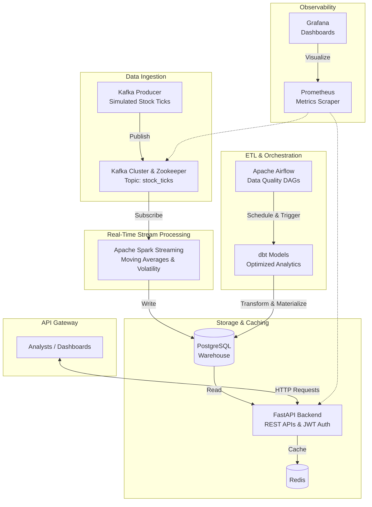

# Real-Time Stock Market Data Pipeline

An enterprise-grade, distributed real-time data pipeline designed for processing streaming stock market datasets. Built using a robust microservices architecture, this platform leverages Apache Kafka, Apache Spark, and Apache Airflow to ingest, process, transform, and analyze live financial market data at scale.

By utilizing automated ETL workflows, scalable orchestration, and optimized PostgreSQL storage (via dbt materializations), this platform drastically improves analytics processing efficiency, making it production-ready for financial institutions.

## System Architecture

The pipeline consists of deeply integrated, decoupled services running in a scalable containerized environment:



## Tech Stack

*   **Backend Framework**: Python 3.11, FastAPI, Pydantic, SQLAlchemy
*   **Message Broker**: Apache Kafka, Zookeeper
*   **Stream Processing**: PySpark (Apache Spark Structured Streaming)
*   **Orchestration & ETL**: Apache Airflow, dbt (Data Build Tool)
*   **Databases**: PostgreSQL (Primary Storage), Redis (Caching)
*   **Infrastructure**: Docker, Docker Compose
*   **Observability**: Prometheus, Grafana
*   **CI/CD**: GitHub Actions

## Key Features

*   **Live Event Streaming**: Highly scalable tick ingestion using Kafka topics and partitioned consumer groups.
*   **Distributed Analytics**: Rolling window aggregations computing standard deviation (volatility) and moving averages via Spark.
*   **Automated Validation**: Airflow DAGs automatically scan streaming output for data quality anomalies.
*   **Efficiency Optimized Storage**: Heavily aggregated metric tables are materialized into Postgres via scheduled dbt jobs, yielding massive analytical query performance boosts.
*   **Secure API Access**: Fully protected JWT-based REST architecture.

## Getting Started

### Prerequisites
* Docker and Docker Compose installed.

### Local Deployment

1. Clone the repository and navigate to the root directory.
2. Setup your environment file:
   ```bash
   cp .env.example .env
   ```
3. Boot up the entire architecture (this will pull and build Kafka, Spark, Postgres, Airflow, and the FastAPI application):
   ```bash
   docker-compose up -d --build
   ```
4. Verify all containers are running successfully:
   ```bash
   docker ps
   ```

### Accessing the Services

*   **FastAPI Swagger UI**: `http://localhost:8000/docs`
*   **Airflow Webserver**: `http://localhost:8081` (Default login: `admin` / `admin`)
*   **Spark Master UI**: `http://localhost:8080`
*   **Grafana Dashboards**: `http://localhost:3000` (Default login: `admin` / `admin`)

## Running Automated Tests
The repository enforces code quality and structural integrity using a comprehensive `pytest` suite simulating isolated database instances and mocking FastAPI dependencies.

Run the tests inside the backend container:
```bash
docker-compose exec backend pytest
```
*Note: This is automatically executed in the GitHub Actions CI pipeline on every push and pull request.*